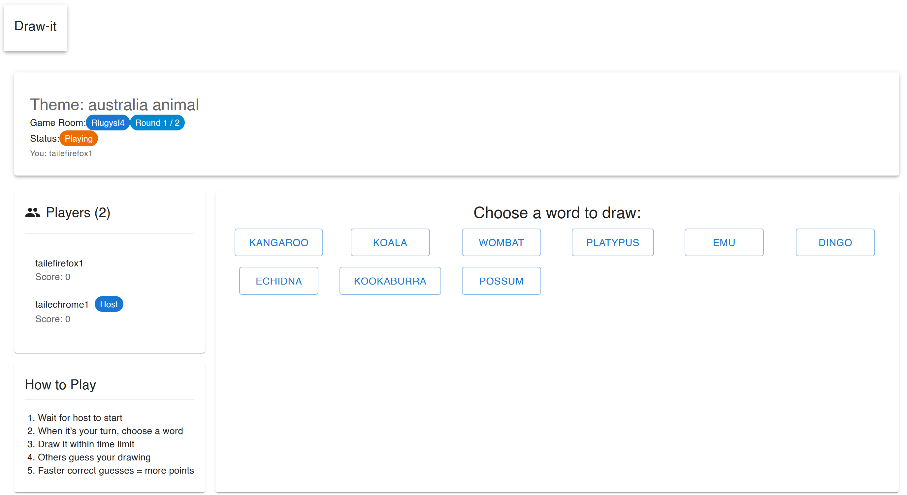
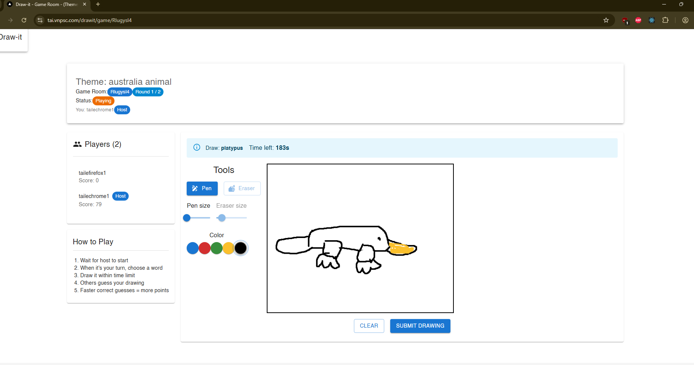

<h1 align="center">
    Draw-it Game - powered by AI
</h1>

A drawing game where a player draw some masterpices for another guessing

View online [Link](https://tai.vnpsc.com/drawit).

Demo:

## Table of Contents

- [Required](#required)
- [Screens List](#screenslist)
- [APIs List](#apislist)

## Required

- Node.js v20.9+
- Next.js v16.0.10
- Java v17
- Redis v8
- MySQL

## Screens List

| No  | Screen Name   | Description                                             | URL                         |
| :-- | :------------ | :------------------------------------------------------ | :-------------------------- |
| 001 | List of game  | List all games                                          | /drawit                     |
| 002 | Create game   | Create a game with username and information of the game | /drawit/create              |
| 003 | Join game     | Join a game with creating username                      | /drawit/join                |
| 004 | Spectate Game | Spectate a game                                         | /drawit/spectate/{gameCode} |
| 005 | Game Room     | Playing game area                                       | /drawit/game/{gameCode}     |

## APIs List

| No     | Method | Description                            | Endpoint                               |
| :----- | :----- | :------------------------------------- | :------------------------------------- |
| 001P01 | GET    | Get all games                          | /drawit/api/games/list                 |
| 002P01 | POST   | Create a new game                      | /drawit/api/create                     |
| 003P01 | POST   | Join an existing game                  | /drawit/api/join                       |
| 004P01 | GET    | Get a game                             | /drawit/spectate/{gameCode}            |
| 005P01 | POST   | Get a game by a player with gameCode   | /drawit/game/{gameCode}                |
| 005P02 | POST   | Start a game by a player with gameCode | /drawit/game/{gameCode}/start          |
| 005P03 | POST   | Submit drawing data                    | /drawit/game/{gameCode}/submit-drawing |
| 005P04 | POST   | Submit guessing data                   | /drawit/game/{gameCode}/submit-guess   |

## Special Thanks

> - Developers : Me (Tai Le)
